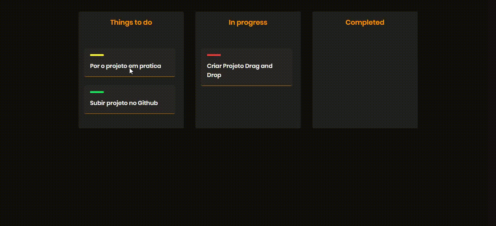

<h1>
Drag and Drop API
</h1>
<h1>

</h1>

## Sobre:
Projeto que simula o conceito de Drag and Drop em uma aplicação real. 
Desenvolvido em conjunto com o professor **Mayk Brito** da **Rocketseat**.

---

## Linguagens utilizdas:
- HTML;
- CSS;
- JavaScrip.